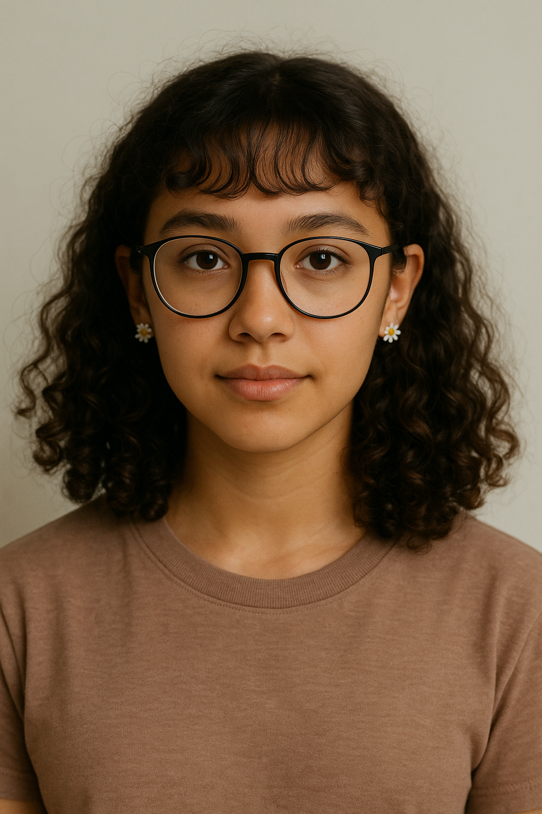
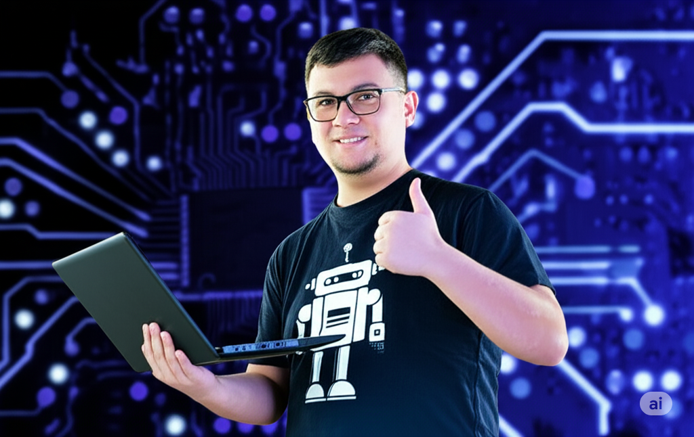
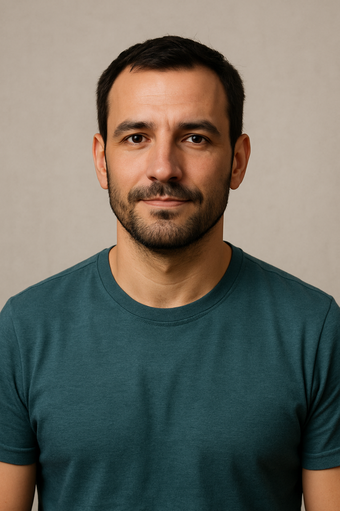

# Personas

---

## 1 - Emily Martins  

**Perfil:**  
- 16 anos  
- Estudante  
- Curso técnico em informática  

**Comportamento:**  
- 📚 Estudiosa  
- 💡 Gosta de aprender coisas novas  
- 🔍 Pesquisa tutoriais no YouTube e fóruns  
- 🛤 Busca trilhas de estudo ordenadas  
- 🎯 Gosta de desafios  

> **Necessidades:**  
> - 🏆 Competir com amigos em estudo  
> - 📚 Conteúdo centralizado  
> - 📊 Ranking de pontuações  
> - 🎓 Obter certificados para o futuro  

---

## 2 - Jetson Xavier  

**Perfil:**  
- 20 anos  
- Estudante de Ciência da Computação  
- Desenvolvedor Jr  
- Apaixonado por jogos e tecnologia  

**Comportamento:**  
- 📰 Atualizado em tendências  
- ⏰ Rotina corrida  
- ⚠️ Dificuldade em manter rotina de estudos  
- 💪 Busca melhorar profissionalmente  
- 💸 Compra cursos, mas não termina  

> **Necessidades:**  
> - ⏰ Lembretes para estudo  
> - 🎮 Motivação via gamificação  
> - ⚡ Tarefas rápidas e funcionais  
> - 🖥 Conhecer mais linguagens  
> - 🏅 Desafio diário com recompensas  

---

## 3 - Rafael Oliveira 
 

**Perfil:**  
- 35 anos  
- Ex-funcionário de logística  
- Em reabilitação após acidente  
- Em transição para tecnologia  

**Comportamento:**  
- 💪 Determinado e resiliente  
- ⚙️ Dificuldade inicial com tecnologia  
- 🎯 Valoriza conteúdo objetivo e acessível  
- 🌙 Estuda em horários flexíveis, principalmente à noite  
- 🚀 Busca aplicação prática e rápida  
- 🤝 Se sente inseguro, mas motivado  

> **Necessidades:**  
> - 🔄 Mudança de área com segurança  
> - ✅ Progresso visível com resultados práticos  
> - ♿ Plataforma inclusiva para iniciantes  
> - 🧭 Suporte com orientação de carreira  
> - 📖 Histórias inspiradoras  
> - 📚 Módulos introdutórios guiados  

---
